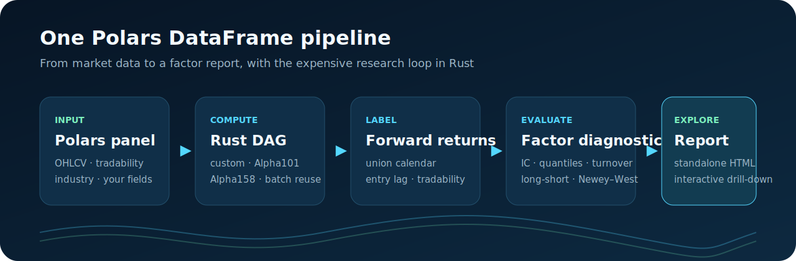
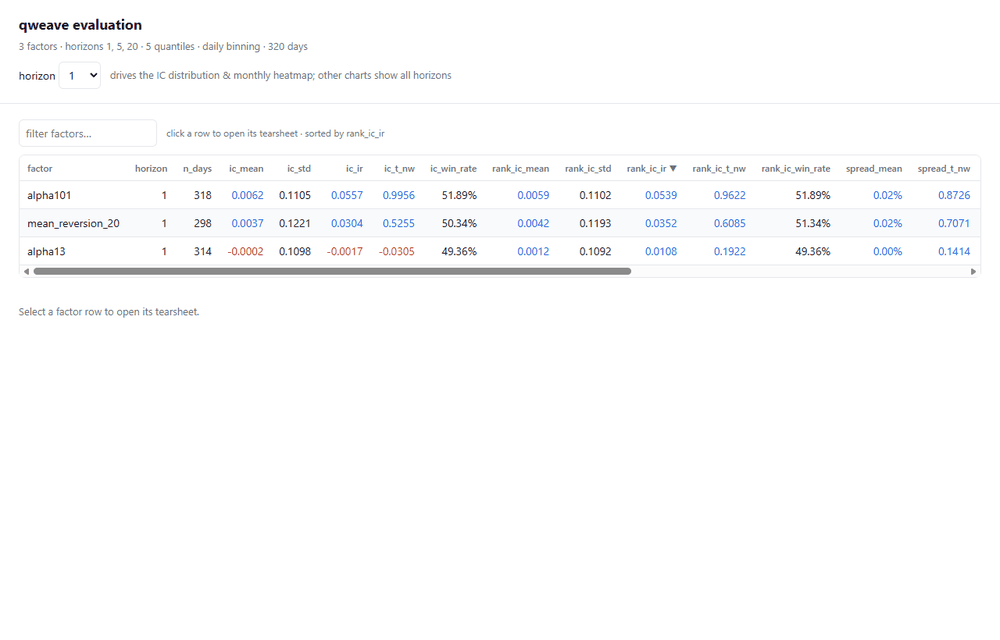

# qweave

[中文](README.md)

[](https://github.com/GaomingOrion/qweave/actions/workflows/ci.yml)
[](https://github.com/GaomingOrion/qweave/releases)
[](https://www.python.org/)
[](LICENSE)

**A Polars-native factor research engine powered by Rust.** qweave takes you
from composable alpha computation and leakage-aware forward-return labels to
IC, quantile, turnover, and interactive report analysis in one DataFrame
pipeline.

- ⚡ **4.8M rows × 158 factors in ~2.2 s:** all Qlib Alpha158 factors on a
  6,000-symbol × 800-day panel in one batch run (measured on a Ryzen 9 9950X).
- 🆚 **23.85× faster than Qlib Alpha158DL:** measured on the same panel, the
  same factor set, and 32 threads for every engine; 2.56× faster end to end
  than KunQuant's JIT C++ path, with no C++ toolchain required. Commands and
  full data in [Benchmarks](docs/benchmark.en.md).
- 🧩 **259 built-in classic factors:** WorldQuant Alpha101 + Qlib Alpha158,
  with time-series and cross-sectional operators in one expression API —
  select, remap inputs, mix, and execute them as one batch.
- 📊 **Interactive report in one line:** `result.view()` opens the embedded
  Vue + ECharts interface with per-factor quantile returns, monthly IC, and
  long-short diagnostics.



> Bring your own Polars market-data panel. Keep your data pipeline. Move the expensive factor-research loop into Rust.

qweave is for quantitative researchers who already manage data with
Parquet/Polars and want fewer per-factor Python loops, repeated rolling
computations, and matrix-alignment problems. It focuses on whether factors carry
stable information about future returns. It is not a data vendor, matching
simulator, or full investment platform.

## Installation

Install directly from
[GitHub Releases](https://github.com/GaomingOrion/qweave/releases/latest)
(CPython 3.10+ stable ABI):

```powershell
# Windows x64
python -m pip install https://github.com/GaomingOrion/qweave/releases/download/v0.4.1/qweave-0.4.1-cp310-abi3-win_amd64.whl
```

```bash
# Linux x86_64
pip install https://github.com/GaomingOrion/qweave/releases/download/v0.4.1/qweave-0.4.1-cp310-abi3-manylinux_2_17_x86_64.manylinux2014_x86_64.whl

# macOS arm64
pip install https://github.com/GaomingOrion/qweave/releases/download/v0.4.1/qweave-0.4.1-cp310-abi3-macosx_11_0_arm64.whl
```

Wheels for other platforms (Linux aarch64, macOS x86_64) are on the
[Releases page](https://github.com/GaomingOrion/qweave/releases/latest).
For source builds see the [Development Guide](docs/development.en.md).

## From Market Data To A Factor Report

The repository includes a deterministic synthetic panel with 80 assets and 320
trading days. This example mixes two classic factors with one custom expression,
then creates labels, evaluates the factors, and opens the interactive report:

```python
import polars as pl
import qweave as qf

df = pl.read_parquet("examples/data/sample_daily.parquet")

alphas = qf.worldquant_alpha101({}, alphas=["alpha13", "alpha101"])
alphas.append(
    (-(qf.col("close") / qf.col("close").delay(20) - qf.lit(1.0)))
    .alias("mean_reversion_20")
)

df = qf.with_alphas(df, "asset", "date", alphas)
df = qf.with_labels(
    df,
    symbol_col="asset",
    time_col="date",
    horizons=[1, 5, 20],
    entry_lag=1,
    tradable_col="tradable",
)

result = qf.evaluate(
    df,
    symbol_col="asset",
    time_col="date",
    factor_cols=["alpha13", "alpha101", "mean_reversion_20"],
    quantiles=5,
    min_cs_count=30,
    tradable_col="tradable_entry",
)

print(result.summary)
result.view()   # opens the interactive evaluation report in your browser
```

Or run the complete example directly:

```powershell
python examples\quickstart.py
```

<p align="center">
  
</p>

## Why qweave

- **DataFrame in, DataFrame out:** qweave takes and returns Polars DataFrames
  directly — no converting the panel to NumPy arrays and stitching results
  back, and no migration to a dedicated data provider.
- **Cross-sectional and time-series factors in the same expression:**
  cross-sectional operators like `rank` and `group_neutralize` live in the
  same DAG as rolling time-series operators, so one `compute_alphas` call runs
  everything — no staged provider/handler workflow that fetches features first
  and organizes cross-sectional computation separately.
- **Execute the whole factor batch once:** expressions enter one Rust DAG with
  common-subexpression reuse, intermediate-slot reuse, fused elementwise
  chains, and node-level parallelism.
- **259 composable classic factors:** WorldQuant Alpha101 and Qlib Alpha158 use
  the same API as custom expressions, so they can be selected, remapped, mixed,
  and executed together.
- **Reports included:** `result.view()` opens the Vue + ECharts interactive
  interface with per-factor drill-down. Thousand-factor workloads can stream
  results to Parquet.

## Performance: Head-To-Head With Qlib And KunQuant

Measured on Windows 11 / Ryzen 9 9950X (16 cores, 32 threads) / 61.7 GiB
memory, on the same 6,000-symbol × 800-day (4.8M-row) synthetic OHLCV panel,
32 threads for every engine, best of three runs after one warmup. KunQuant is
measured end to end in f64, including input/output DataFrame conversion and
JIT compilation:

| Workload | qweave | Competitor | Takeaway |
| --- | ---: | ---: | --- |
| All 158 Qlib Alpha158 factors | **2.24 s** | Qlib Alpha158DL: 53.37 s | 23.85× faster, about 46% less peak RSS |
| WorldQuant Alpha101 (82 factors) | **3.11 s** | KunQuant f64: 7.95 s | 2.56× faster end to end, about 31% less peak RSS, no C++ toolchain |

Where the speed comes from: sorting, rolling windows, cross-sectional
operators, and evaluation statistics run on the Rust hot path; the whole
expression batch enters one DAG with common-subexpression reuse, slot reuse,
and node-level parallelism managed by the engine. Full environment, commands,
and publishing conventions in [Benchmarks](docs/benchmark.en.md).

## Factor Evaluation: Leakage-Free, Everything In One Run

```text
Signal T ── entry_lag ──> Entry T+1 ── horizon h ──> Exit T+1+h
```

- T+1 entry by default, no look-ahead; halts and missing rows cannot silently
  shorten the holding period, and entry-day tradability is aligned back to the
  signal day automatically.
- One `evaluate` call produces IC/RankIC, quantile returns, turnover, rank
  autocorrelation, and long-short diagnostics, with Newey–West t-statistics
  correcting overlapping-horizon significance.
- `result.view()` opens the interactive report directly; thousand-factor runs
  can stream to Parquet.

See [Factor Evaluation](docs/factor_evaluation.en.md) for exact calibers and
parameters.

## When To Choose qweave

- Your market data already lives in a Parquet/Polars pipeline and you do not
  want to migrate to a platform-specific data format or a staged
  provider/handler workflow just to compute factors.
- You compute and evaluate tens to thousands of factors at a time, and
  per-factor Python loops have become the bottleneck of research iteration.
- You are building automated factor mining or a research agent: an
  easy-to-write expression API, high-throughput batch execution, and unified
  evaluation calibers make qweave a natural kernel for an agent's
  "generate → compute → evaluate" experiment loop.

When you need a full platform with data ingestion, model training, and
backtest experiment management, Qlib is the better fit — and qweave can be
embedded in such platforms or agent systems as the factor computation and
evaluation kernel. See [Comparison](docs/comparison.en.md) for details.

## Roadmap

- **An experiment kernel for research agents:** an easy-to-write expression
  API, high-throughput batch execution, and unified evaluation calibers
  powering the automated "generate factors → batch compute → strict evaluate"
  factor-mining loop.
- Publish to PyPI so installation becomes a single `pip install qweave`.
- Expand the built-in factor libraries and time-series/cross-section operators.
- Keep improving the interactive report as the default way to inspect
  evaluation results.

## Documentation Path

Follow the [documentation home](docs/index.en.md) in order:

1. [Runnable example](examples/README.en.md)
2. [Python Expression API](docs/expression_api.en.md)
3. [WorldQuant 101](docs/worldquant_alpha101.en.md) / [Qlib Alpha158](docs/qlib_alpha158.en.md)
4. [Factor Evaluation](docs/factor_evaluation.en.md)
5. [Architecture](docs/architecture.en.md) / [Benchmarks](docs/benchmark.en.md)

## Project Status

The factor-computation, labeling, evaluation, and reporting workflow is usable
today, while the API remains pre-1.0.

See [CONTRIBUTING](CONTRIBUTING.en.md) to contribute. This project is not
affiliated with WorldQuant, Microsoft, Qlib, or KunQuant.

## License

MIT. See [LICENSE](LICENSE).
