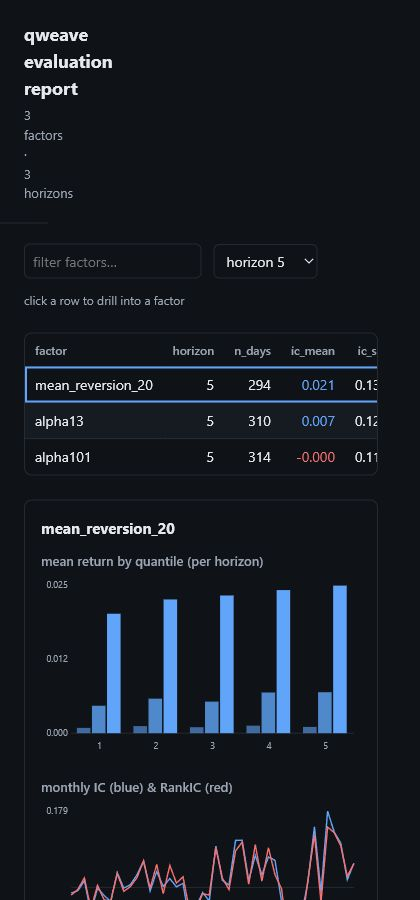

# qweave

[中文](README.md)

[](https://github.com/GaomingOrion/qweave/actions/workflows/ci.yml)
[](https://github.com/GaomingOrion/qweave/releases)
[](https://www.python.org/)
[](LICENSE)

**A Polars-native factor research engine powered by Rust.** qweave takes you
from composable alpha computation and leakage-aware forward-return labels to
IC, quantile, turnover, and interactive report analysis in one DataFrame
pipeline.

> Bring your own Polars market-data panel. Keep your data pipeline. Move the expensive factor-research loop into Rust.


qweave is for quantitative researchers who already manage data with
Parquet/Polars and want fewer per-factor Python loops, repeated rolling
computations, and matrix-alignment problems. It focuses on whether factors carry
stable information about future returns. It is not a data vendor, matching
simulator, or full investment platform.

## Installation

qweave is not published to PyPI yet. v0.4.1 provides CPython 3.10+ stable-ABI
wheels for Windows, Linux, and macOS on
[GitHub Releases](https://github.com/GaomingOrion/qweave/releases/latest).
Download the matching file and install it. For example, on Windows x64:

```powershell
python -m pip install .\qweave-0.4.1-cp310-abi3-win_amd64.whl
```

For source development or evaluation:

```powershell
git clone https://github.com/GaomingOrion/qweave.git
Set-Location qweave
uv sync --dev --locked
uv run maturin develop --uv --release
```

Source builds require Python 3.10+, `uv`, and the pinned Rust nightly toolchain.
See the [Development Guide](docs/development.en.md) for details.

## From Market Data To A Factor Report

The repository includes a deterministic synthetic panel with 80 assets and 320
trading days. This example mixes two classic factors with one custom expression,
then creates labels, evaluates the factors, and exports a report:

```python
import polars as pl
import qweave as qf

df = pl.read_parquet("examples/data/sample_daily.parquet")

alphas = qf.worldquant_alpha101({}, alphas=["alpha13", "alpha101"])
alphas.append(
    (-(qf.col("close") / qf.col("close").delay(20) - qf.lit(1.0)))
    .alias("mean_reversion_20")
)

df = qf.with_alphas(df, "asset", "date", alphas)
df = qf.with_labels(
    df,
    symbol_col="asset",
    time_col="date",
    horizons=[1, 5, 20],
    entry_lag=1,
    tradable_col="tradable",
)

result = qf.evaluate(
    df,
    symbol_col="asset",
    time_col="date",
    factor_cols=["alpha13", "alpha101", "mean_reversion_20"],
    quantiles=5,
    min_cs_count=30,
    tradable_col="tradable_entry",
)

print(result.summary)
result.to_html("qweave-report.html")
```

Or run the complete example directly:

```powershell
uv run python examples\quickstart.py
```

The synthetic panel's actual five-day output is shown below. It verifies the
workflow; it is not evidence of real market performance.

| factor | RankIC mean | RankIC IR | top-bottom spread mean |
| --- | ---: | ---: | ---: |
| `alpha13` | 0.008565 | 0.070432 | 0.000899 |
| `alpha101` | -0.002198 | -0.019618 | -0.000278 |
| `mean_reversion_20` | 0.022806 | 0.181762 | 0.002273 |

<p align="center">
  
</p>

## Why qweave

- **One DataFrame pipeline:** factors, labels, and evaluation results stay
  around the input Polars DataFrame, reducing separate matrices, repeated
  conversions, and alignment errors.
- **Execute the whole factor batch once:** expressions enter one Rust DAG with
  common-subexpression reuse, intermediate-slot reuse, fused elementwise
  chains, and node-level parallelism.
- **259 composable classic factors:** WorldQuant Alpha101 and Qlib Alpha158 use
  the same API as custom expressions, so they can be selected, remapped, mixed,
  and executed together.
- **Explicit research semantics:** union calendars, `entry_lag`, entry-day
  tradability, deterministic binning, and Newey–West statistics for overlapping
  horizons all have documented definitions.
- **Reports included:** `EvalResult.to_html()` exports a self-contained report,
  while `view()` opens the Vue + ECharts interface. Thousand-factor workloads
  can stream results to Parquet.

## Measured Benefit Of The Batch DAG

On 2026-07-10, the benchmark was rerun on Windows 11, a Ryzen 9 9950X, and
61.7 GiB of memory with 5,000 symbols × 1,000 days × all 158 Alpha158 factors.
Both paths assemble the same complete output:

| Execution path | Best | Mean | Process peak RSS |
| --- | ---: | ---: | ---: |
| qweave batch DAG | **2.9630 s** | 3.0399 s | 9,934.4 MiB |
| qweave per-factor calls | 50.4918 s | 51.4664 s | 8,404.1 MiB |

On this synthetic panel, the batch DAG's best time was about **17.0× lower**
than the per-factor path, at the cost of about 1.5 GiB more peak memory. Results
depend on the machine, version, and data shape; see
[Performance and Benchmarks](docs/benchmark.en.md) for the full environment,
commands, and methodology.

## Research Semantics Before Attractive Numbers

The default label is defined as:

```text
Signal T ── entry_lag ──> Entry T+1 ── horizon h ──> Exit T+1+h
```

- Date offsets use the market-wide union calendar, so a missing asset row does
  not silently compress the holding period.
- `tradable_entry` aligns entry-day tradability back to the signal day, making
  sample eligibility explicit.
- Evaluation includes Pearson IC, Spearman RankIC, quantile returns, turnover,
  rank autocorrelation, and long-short diagnostics.
- Mean tests for overlapping forward returns use Newey–West t-statistics.

See [Factor Evaluation](docs/factor_evaluation.en.md) for exact definitions and
non-goals.

## Boundaries With Other Projects

| If you need | A better fit |
| --- | --- |
| A complete AI quant platform for data, models, portfolios, backtesting, and execution | Qlib |
| Expression batches compiled into C++/JIT execution paths | KunQuant |
| Traditional single-factor analysis in the pandas ecosystem | Alphalens-style tools |
| Batch factor computation, strict labels, and evaluation reports inside an existing Polars pipeline | **qweave** |

qweave can run independently or serve as the factor-research kernel in a larger
platform. See [Comparison](docs/comparison.en.md) for details.

## Documentation Path

Follow the [documentation home](docs/index.en.md) in order:

1. [Runnable example](examples/README.en.md)
2. [Python Expression API](docs/expression_api.en.md)
3. [WorldQuant 101](docs/worldquant_alpha101.en.md) / [Qlib Alpha158](docs/qlib_alpha158.en.md)
4. [Factor Evaluation](docs/factor_evaluation.en.md)
5. [Architecture](docs/architecture.en.md) / [Performance and Benchmarks](docs/benchmark.en.md)

## Project Status

The factor-computation, labeling, evaluation, and reporting workflow is usable
today, while the API remains pre-1.0. qweave does not currently simulate order
matching, slippage, exit-side liquidity, or complete strategy equity curves.

See [CONTRIBUTING](CONTRIBUTING.en.md) to contribute. This project is not
affiliated with WorldQuant, Microsoft, Qlib, or KunQuant.

## License

MIT. See [LICENSE](LICENSE).
